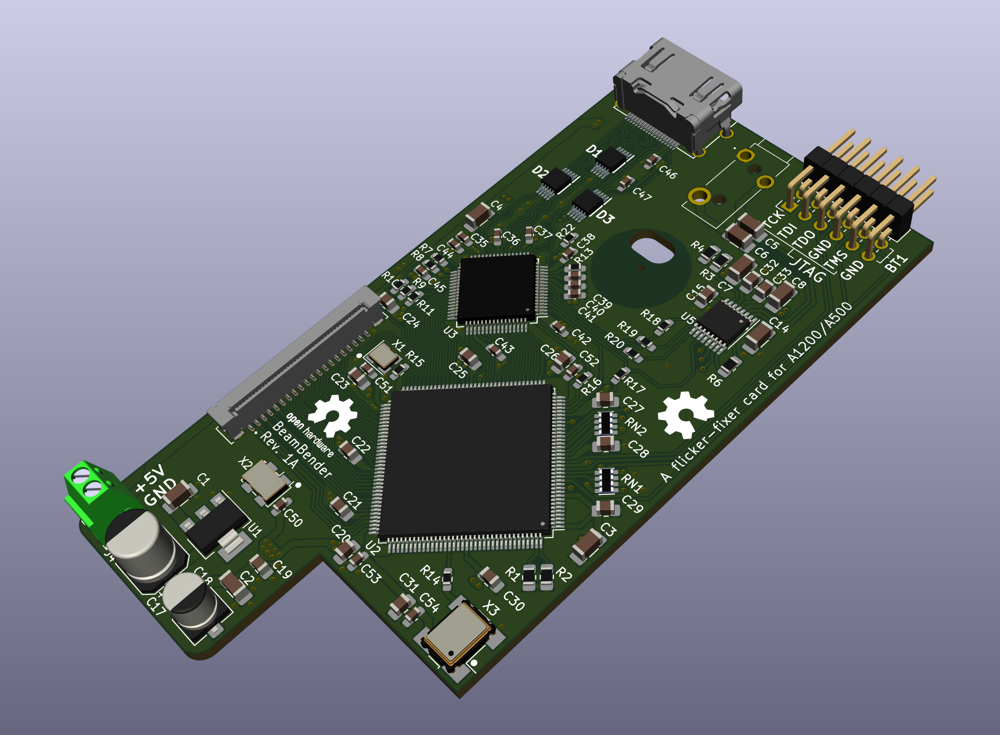
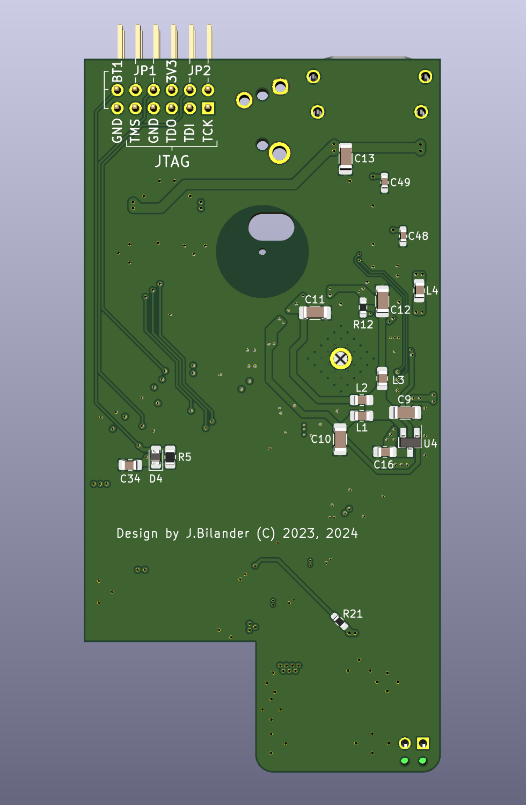
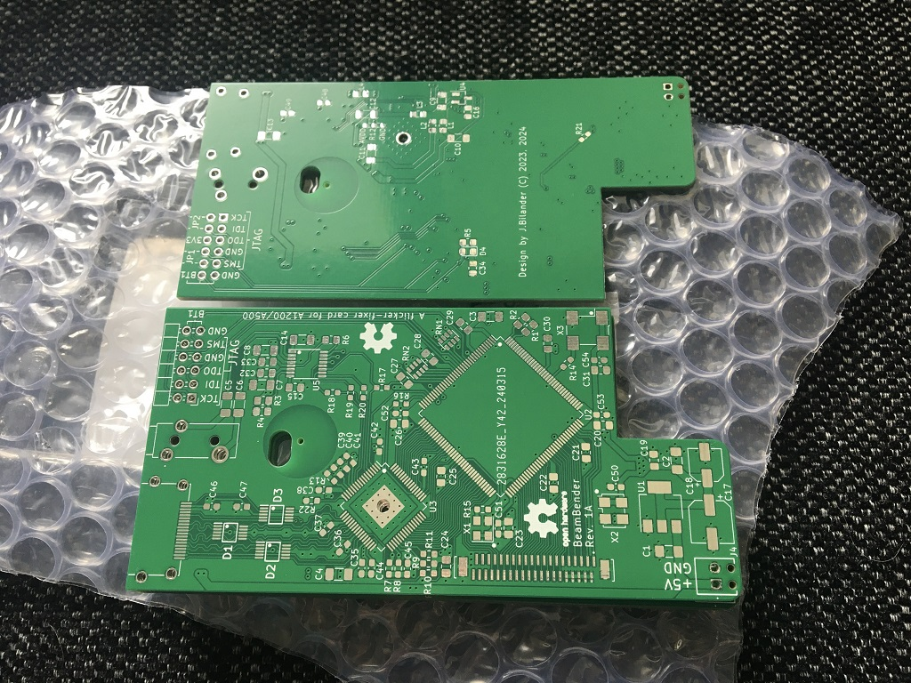
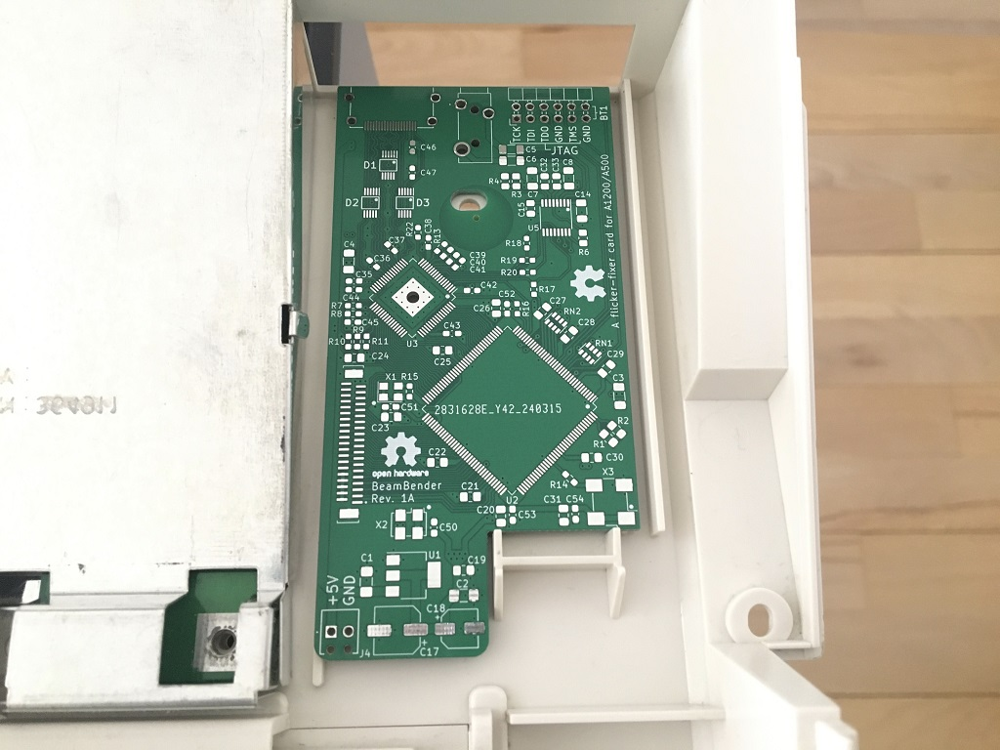
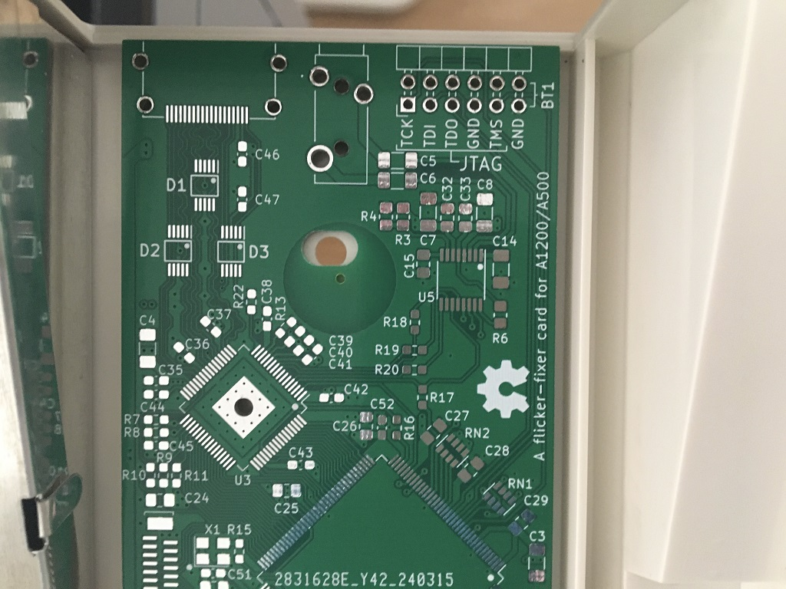
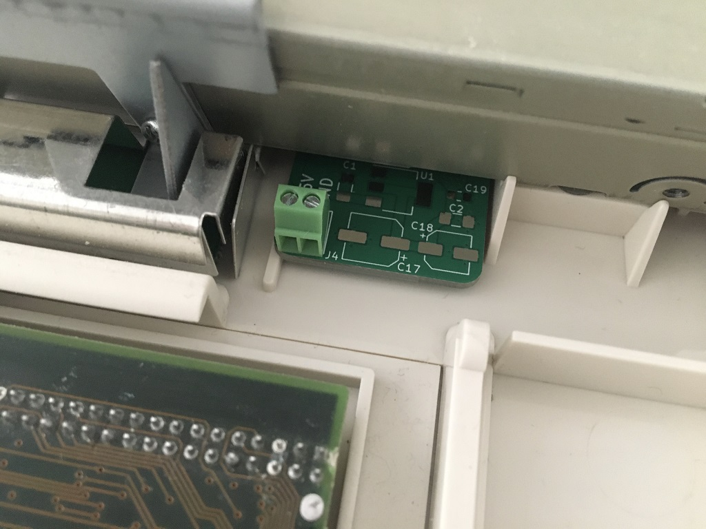

# BeamBender
An open source flicker fixer PCB for Amiga 1200 and 500 to be fitted under the floppy drive.

WORK IN PROGRESS, NOT FINISHED!!!

***

Rev. 1A
 

 

 

 

 

***

[ADV7513_Hardware_User_Guide.pdf](https://www.analog.com/media/en/technical-documentation/user-guides/ADV7513_Hardware_User_Guide.pdf) 

[ADV7513_Programming_Guide.pdf](https://www.analog.com/media/en/technical-documentation/user-guides/ADV7513_Programming_Guide.pdf)

***

BOM Rev. 1A
---------
Designator  | Name/Value   | Package | Notes
-|-|-|-|
U1 | Voltage Regulator 3.3V,   LM1117-3.3 or   AMS1117-3.3 | SOT-223 | 3.3V 1A Low Drop-Out (LDO) Voltage regulator. https://www.aliexpress.com/item/32869037691.html
U2 | Gowin FPGA GW1NR-UV9LQ144PC6/I5 | LQFP-144 | FPGA - Field Programmable Gate Array, 8640 LE, 121 I/O, Embedded 64Mbit 16-bit PSRAM   [GW1NR-UV9LQ144PC6/I5](https://www.mouser.com/ProductDetail/192-1NRUV9LQ144PC6I5)
U3 | ADV7513BSWZ | TQFP-64-1EP_10x10mm_P0.5mm_EP5x5mm | 165 MHz High Performance HDMI Transmitter [ADV7513BSWZ](https://www.lcsc.com/product-detail/Video-Interface-ICs_Analog-Devices-ADV7513BSWZ_C408901.html)
U4 | Voltage Regulator 1.8V,   MCP1702T-1802E/CB | SOT-23 | 1.8V Low Drop-Out (LDO) Voltage regulator. [MCP1702T1802E-CB](https://www.mouser.com/ProductDetail/579-MCP1702T1802E-CB)
U5 | Audio A/D Converter AK5720VT | TSSOP-16 | ADC IC 2ch 24bit 96K. [AK5720VT](https://www.mouser.se/ProductDetail/412-AK5720VT)
X1 | Abracon ASE-27.000MHZ-L-R-T | XTAL OSC SMD 3.2 mm x 2.5 mm | Standard Clock Oscillator XO 27MHZ CMOS SMD [ASE-27.000MHZ-L-R-T](https://www.mouser.com/ProductDetail/815-ASE-27.000-LR-T)
X2 | Abracon ASFL1-24.576MHZ-EC-T | XTAL OSC SMD 5.0 mm x 3.2 mm | Standard Clock Oscillators 24.576 MHZ 15PF 3.3V [ASFL1-24.576MHZ-EC-T](https://www.mouser.com/ProductDetail/815-ASFL1-24.5-EC-T)
X3 | Standard Clock Oscillator 50 MHz, 3.3V LVCMOS | XTAL OSC SMD 7 mm x 5 mm | e.g. [FN5000109](https://www.mouser.com/ProductDetail/729-FN5000109) or [LH736050](https://www.mouser.com/ProductDetail/972-LH736050.000000I)
J1 | FFC & FPC Connectors .5 FPC VT ZIF Type-A | 40 Position FPC connector, Pitch 0.5 mm | [TE Connectivity 4-1734742-0](https://www.mouser.com/ProductDetail/571-4-1734742-0)
J2 | HDMI 1.4 Receptacle Connector 19 Position Surface Mount, Right Angle TH | HDMI Receptacle | [Amphenol 10029449-111RLF](https://www.mouser.com/ProductDetail/649-10029449-111RLF)
J3 | Phone Connectors 3.5 mm, Stereo | 3 Position Through Hole | [Kycon STX-3501-3N](https://www.mouser.com/ProductDetail/806-STX-3501-3N)
J4 | VCC/GND Phoenix Contact 2pin 2.54mm pitch | Fixed Terminal Blocks 2P 2.54mm 90DEG | VIN +5V   Be careful with orientation, check polarity BEFORE connecting anything here. You can take +5V/GND from internal floppy pin-header on Amiga motherboard. [1725656](https://www.mouser.com/ProductDetail/651-1725656) or [Aliexpress](https://www.aliexpress.com/item/1005001677869988.html)
D1-D3 | ESD Suppressors / TVS Diodes | MSOP-10 | [D5V0F4U10MR-13](https://www.mouser.com/ProductDetail/621-D5V0F4U10MR-13)
D4 | Diode - General Purpose | 0805 | e.g. [TS4148RBG](https://www.mouser.com/ProductDetail/821-TS4148RBG) Diode in RC-debounce (R5, C34) circuit for BT1 (Button 1).
L1-L4 | SMD Stacked Inductor 10uH | 0805 |
C1-C13 | Capacitor 10uF | 1206 |
C14 | Capacitor 0.47uF | 1206 | e.g. [UMK316B7474KL-T](https://www.mouser.com/ProductDetail/963-UMK316B7474KL-T)
C15, C16 | Capacitor 1.0uF | 0805 |
C17 | Polarized Capacitor 100uF | CP_Elec_6.3x7.7 | e.g. [Wurth SMD WCAP-AS5H 100uF](https://www.mouser.com/ProductDetail/710-865230245004)
C18 | Polarized Capacitor 22uF | CP_Elec_5x5.8 | e.g. [Wurth SMD WCAP-AS5H 22uF](https://www.mouser.com/ProductDetail/710-865230342002)
C19-C34 | Capacitor 0.1uF = 100nF | 0805 |
C35-C49 | Capacitor 0.1uF = 100nF | 0603 |
C50-C54 | Capacitor 0.01uF = 10nF | 0603 |
R1-R3 | 1k Ω | 0805 |
R4, R5 | 10k Ω | 0805 |
R6 | 0-9 Ω or solder blob| 0805 | e.g. [CR0805-J/-000ELF](https://www.mouser.com/ProductDetail/652-CR0805-J-000ELF)
R7-R12 | 2k Ω | 0603 | e.g. [CR0603-FX-2001ELF](https://www.mouser.com/ProductDetail/652-CR0603-FX-2001LF)
R13 | 887 Ω, 1% tolerance | 0603 | e.g. [CR0603-FX-8870ELF](https://www.mouser.com/ProductDetail/652-CR0603FX-8870ELF)
R14-R21 | 33 Ω | 0603 | e.g. [CR0603-FX-33R0ELF](https://www.mouser.com/ProductDetail/652-CR0603FX-33R0ELF)
R22 | 10k Ω | 0603 |
RN1, RN2 | CAY16-103J4LF RES ARRAY 4 Resistors 10k Ω | 1206 | [CAY16-103J4LF](https://www.mouser.com/ProductDetail/652-CAY16-103J4LF)

***

[![CC BY-SA 4.0][cc-by-sa-shield]][cc-by-sa]

This work is licensed under a
[Creative Commons Attribution-ShareAlike 4.0 International License][cc-by-sa].

[![CC BY-SA 4.0][cc-by-sa-image]][cc-by-sa]

[cc-by-sa]: http://creativecommons.org/licenses/by-sa/4.0/
[cc-by-sa-image]: https://licensebuttons.net/l/by-sa/4.0/88x31.png
[cc-by-sa-shield]: https://img.shields.io/badge/License-CC%20BY--SA%204.0-lightgrey.svg
